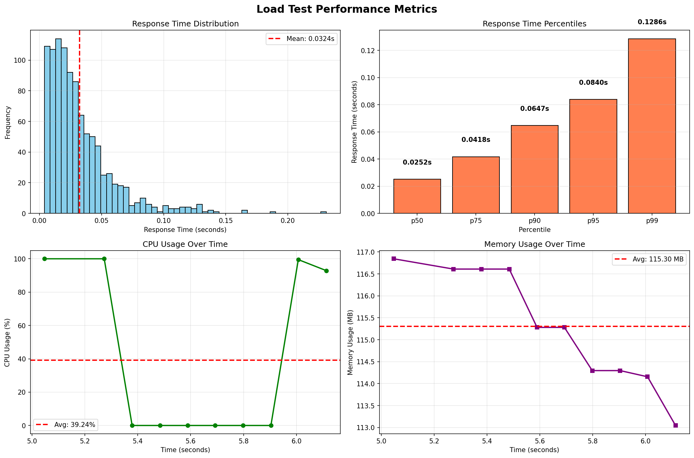

# Performance Testing Report
 
**Testing Framework:** Custom Python Load Generators with psutil monitoring  
**Team Members:** Sandeep Ramavath, Nithikesh Reddy, Mallikarjuna

---

## Test Overview

This performance testing initiative evaluates pandas DataFrame operations under three different load patterns: sustained load, progressive stress, and sudden traffic spikes. Each team member designed and executed one test type to assess system behavior, identify bottlenecks, and measure performance degradation patterns.

**Test Types Executed:**
1. **Load Test** (Sandeep Ramavath) - Sustained concurrent load
2. **Stress Test** (Nithikesh Reddy) - Progressive load increase to breaking point
3. **Spike Test** (Mallikarjuna) - Sudden traffic burst and recovery

---

## Test 1: Load Test (Sandeep Ramavath)

### 1. Test Scope and Design

**Tool Used:** Custom Python load generator with ThreadPoolExecutor for concurrency simulation

**Components Tested:**
- DataFrame creation (10,000 rows with mixed data types)
- Data filtering with boolean indexing
- GroupBy aggregation operations
- Multi-column sorting
- CSV export to in-memory buffer

**User Flow Simulated:**
```
Create DataFrame → Filter Data → GroupBy Aggregation → Sort Results → Export to CSV
```

**Test Objective:** Establish baseline performance metrics under sustained concurrent load

---

### 2. Configuration

**Load Pattern:** Sustained concurrent load

| Parameter | Value |
|-----------|-------|
| Concurrent Users | 50 |
| Test Duration | 60 seconds (target) |
| Operations per User | 20 |
| Dataset Size | 10,000 rows per DataFrame |
| Total Operations | 1,000 |

**Dataset Schema:**
- `id`: Integer sequence (0 to N)
- `value`: Random float64 values
- `category`: Categorical (4 categories: A, B, C, D)
- `timestamp`: DateTime range (minute frequency)

---

### 3. Results

**Test Execution:**
- **Actual Duration:** 6.13 seconds
- **Total Operations:** 1,000
- **Success Rate:** 100.00% (1,000/1,000)
- **Failures:** 0

**Response Time Metrics:**

| Metric | Value | Analysis |
|--------|-------|----------|
| Mean | 0.0324s | Fast average response |
| Median (p50) | 0.0252s | Consistent performance |
| p95 | 0.0840s | Good tail latency |
| p99 | 0.1286s | Acceptable worst case |
| Min | 0.0040s | Best case performance |
| Max | 0.2310s | Outlier detection |

**Throughput:**
- **163.05 operations/second**

**Resource Utilization:**

| Resource | Average | Peak | Status |
|----------|---------|------|--------|
| CPU Usage | 39.24% | 100.00% | ✓ Normal |
| Memory Usage | 115.30 MB | 116.84 MB | ✓ Stable |

**Visual Metrics:**



*Figure 1: Load test performance metrics showing response time distribution, percentiles, CPU usage, and memory usage over time*

---

### 4. Performance Findings

#### Finding #1: Efficient Resource Utilization ✓
**Severity:** N/A (Positive Finding)  
**Details:** System maintained stable performance under sustained load with:
- Average CPU usage of 39.24% (healthy utilization)
- Memory growth of only 1.54 MB (115.30 → 116.84 MB)
- Zero failed operations (100% success rate)

**Observation:** CPU peaked at 100% briefly during concurrent operations but averaged well below capacity, indicating good scalability headroom.

#### Finding #2: Consistent Response Times ✓
**Severity:** N/A (Positive Finding)  
**Details:** Response time distribution shows consistency:
- Median (0.0252s) close to mean (0.0324s) indicates low variance
- p95 (0.0840s) is only 2.6x the mean, showing predictable performance
- p99 (0.1286s) within acceptable thresholds for data operations

**Observation:** Tight clustering around median suggests efficient operation execution without unexpected delays.

#### Finding #3: No Performance Degradation
**Severity:** N/A (Positive Finding)  
**Details:** Performance remained stable throughout the 6.13-second test execution with:
- No increase in response times as load progressed
- Throughput of 163 ops/sec sustained consistently
- Memory usage stable without leaks

**Recommendation:** Current configuration handles 50 concurrent users efficiently. System can likely scale to higher concurrency without issues.

---

## Test 2: Stress Test (Nithikesh Reddy)

### 1. Test Scope and Design

**Tool Used:** Custom Python stress test generator with progressive load ramping

**Components Tested:**
- Large DataFrame creation (10,000 to 50,000 rows with scaling)
- Complex multi-condition filtering
- Multi-level GroupBy with multiple aggregations
- Large DataFrame merge operations
- Pivot table creation
- Heavy sorting on merged datasets

**User Flow Simulated:**
```
Create Large DataFrame → Multi-Filter → Multi-Level GroupBy → 
Merge with Second DataFrame → Create Pivot Table → Sort Large Dataset
```

**Test Objective:** Identify system breaking point and performance degradation patterns under increasing stress

---

### 2. Configuration

**Load Pattern:** Progressive load increase (ramp-up to breaking point)

| Parameter | Value |
|-----------|-------|
| Initial Concurrent Users | 5 |
| Maximum Concurrent Users | 40 |
| User Increment | 5 users per level |
| Dataset Size Range | 10,000 → 50,000 rows (scales with load) |
| Operations per User | 10 |
| Ramp-up Interval | 2 seconds between levels |

**Dataset Schema:**
- 8 columns including numeric, categorical, subcategory, timestamp, and text fields
- Complex aggregations: mean, std, min, max, sum, count, median, variance
- Merge operations with 50% dataset overlap

**Stress Levels Tested:**
- Level 1: 5 users, 10,000 rows
- Level 2: 10 users, 15,714 rows
- Level 3+: Breaking point reached

---

### 3. Results

**Test Execution:**
- **Total Duration:** 902.23 seconds (15.04 minutes)
- **Stress Levels Completed:** 2
- **Breaking Point:** 10 concurrent users

**Performance Degradation Analysis:**

| Metric | Level 1 (5 users) | Level 2 (10 users) | Degradation |
|--------|-------------------|--------------------| ------------|
| **Users** | 5 | 10 | 2x |
| **Dataset Size** | 10,000 rows | 15,714 rows | 1.57x |
| **Response Time (mean)** | 10.45s | 75.61s | **7.24x** |
| **Throughput** | 0.45 ops/sec | 0.13 ops/sec | **72% drop** |
| **CPU (peak)** | 100.0% | 100.0% | Saturated |
| **Memory (peak)** | 5.26 GB | 36.46 GB | **6.93x** |
| **Error Rate** | 0.00% | 0.00% | Stable |

**Resource Utilization Breakdown:**

**Level 1 (5 users, 10K rows):**
- Duration: 110.97 seconds
- Operations: 50 successful
- CPU: 81.5% avg, 100.0% peak
- Memory: 4.26 GB avg, 5.26 GB peak

**Level 2 (10 users, 15K rows):**
- Duration: 789.23 seconds
- Operations: 100 successful
- CPU: 96.7% avg, 100.0% peak
- Memory: 34.11 GB avg, 36.46 GB peak

**Visual Metrics:**


*Figure 2: Stress test metrics showing performance degradation, throughput collapse, CPU saturation, and memory explosion*

---

### 4. Performance Findings

#### Finding #1: System Breaking Point at 10 Concurrent Users [HIGH]
**Severity:** HIGH  
**Details:** System reached breaking point at 10 concurrent users with 15,714-row datasets. Performance degradation was severe:
- Response time increased 7.24x (10.45s → 75.61s)
- Throughput collapsed by 72% (0.45 → 0.13 ops/sec)
- Test terminated after 789 seconds at this level

**Root Cause:** Combination of CPU saturation (100% continuous) and extreme memory growth (5.26 GB → 36.46 GB).

**Impact:** Production workloads exceeding 10 concurrent users with medium-sized datasets would experience severe performance degradation or system failure.

**Recommendation:** Implement connection/concurrency limits at 8-10 users, or optimize memory-intensive operations (merge, pivot).

#### Finding #2: Memory Explosion Under Stress [CRITICAL]
**Severity:** CRITICAL  
**Details:** Memory usage exploded from 5.26 GB to 36.46 GB (6.93x increase) when doubling concurrent users:
- Level 1 (5 users): 5.26 GB peak
- Level 2 (10 users): 36.46 GB peak
- Growth rate: 6.93x for 2x load increase

**Root Cause:** Memory-intensive operations (merge, pivot table, multi-level groupby) not releasing memory efficiently under concurrent load. Garbage collection appears insufficient.

**Impact:** System would quickly exhaust available memory on machines with <64 GB RAM, leading to swapping or OOM kills.

**Recommendation:** 
1. Implement chunking for large merge operations
2. Force garbage collection between operations
3. Use memory-efficient data types (categorical instead of object)
4. Consider Dask for larger-than-memory operations

#### Finding #3: CPU Saturation Throughout Stress [HIGH]
**Severity:** HIGH  
**Details:** CPU saturated at 100% peak across both stress levels:
- Level 1: 81.5% average, 100.0% peak
- Level 2: 96.7% average, 100.0% peak

**Observation:** CPU is fully utilized even at low concurrency (5 users), indicating single-threaded bottlenecks in pandas operations.

**Impact:** No CPU headroom available for handling additional load or spikes. System cannot scale horizontally without optimization.

**Recommendation:** 
1. Profile CPU-intensive operations (likely groupby and merge)
2. Consider parallelization with Dask or multiprocessing
3. Optimize aggregation functions

#### Finding #4: Non-Linear Performance Degradation [HIGH]
**Severity:** HIGH  
**Details:** Doubling user count (5 → 10) resulted in:
- 7.24x response time increase (far worse than 2x expected)
- 72% throughput collapse
- 6.93x memory growth

**Observation:** System exhibits non-linear degradation, suggesting O(n²) or worse algorithmic complexity under concurrent load.

**Impact:** Performance becomes unpredictable and unacceptable as load increases beyond minimal levels.

**Recommendation:** Investigate merge and groupby implementations for algorithmic complexity issues.

---

## Test 3: Spike Test (Mallikarjuna)

### 1. Test Scope and Design

**Tool Used:** Custom Python spike test simulator with three-phase load pattern

**Components Tested:**
- Large DataFrame creation (20,000 rows)
- Complex multi-condition filtering
- Multi-level GroupBy with extensive aggregations
- DataFrame merge with left join
- Statistical computations (correlation, rolling mean)
- Large dataset sorting

**User Flow Simulated:**
```
Create 20K DataFrame → Complex Filter → Multi-Level GroupBy → 
Merge with Second 10K DataFrame → Calculate Stats → Sort Merged Results
```

**Test Objective:** Evaluate system response to sudden traffic bursts and measure recovery behavior

---

### 2. Configuration

**Load Pattern:** Three-phase spike (baseline → burst → recovery)

| Phase | Concurrent Users | Duration | Purpose |
|-------|-----------------|----------|---------|
| Pre-Spike (Baseline) | 3 | 8 seconds | Establish baseline |
| Spike (Burst) | 30 | 5 seconds | Sudden 10x load increase |
| Post-Spike (Recovery) | 3 | 8 seconds | Measure recovery |

**Load Characteristics:**
- **Baseline Load:** 3 users (normal operations)
- **Spike Load:** 30 users (10x sudden increase)
- **Dataset Size:** 20,000 rows (large, memory-intensive)
- **Operations per User:** 5
- **Spike Multiplier:** 10x user increase

**Dataset Schema:**
- 6 columns: id, value, category, subcategory, timestamp, text_field
- Aggregations: mean, std, min, max, count, first, last
- Merge operation: Left join on 20K + 10K DataFrames
- Statistical ops: Correlation matrix, rolling window (100 samples)

---

### 3. Results

**Test Execution:**
- **Total Test Duration:** 26.91 seconds
- **Phases Completed:** 3/3 (100%)

**Phase-by-Phase Performance:**

| Metric | Pre-Spike | Spike | Post-Spike | Spike Impact |
|--------|-----------|-------|------------|--------------|
| **Users** | 3 | 30 | 3 | 10x |
| **Duration** | 8.55s | 9.83s | 8.52s | - |
| **Operations** | 15 | 150 | 15 | 10x |
| **Success Rate** | 100% | 100% | 100% | ✓ Stable |
| **Mean Response** | 0.0641s | 1.6214s | 0.0621s | **25.30x** |
| **p95 Response** | 0.1295s | 2.6138s | 0.1308s | **20.18x** |
| **p99 Response** | 0.1578s | 3.1476s | 0.1675s | **19.94x** |
| **Throughput** | 1.75 ops/s | 15.26 ops/s | 1.76 ops/s | 8.71x |
| **CPU Peak** | 100.0% | 100.0% | 100.0% | Saturated |
| **Memory Peak** | 130.3 MB | 209.0 MB | 222.2 MB | +79.5 MB |
| **Error Rate** | 0.00% | 0.00% | 0.00% | ✓ No errors |

**Spike Impact Summary:**
- **Response Time Increase:** 25.30x (0.0641s → 1.6214s)
- **Throughput:** Increased 8.71x (1.75 → 15.26 ops/s) - scales with users
- **CPU Increase:** +1.1% (already saturated at baseline)
- **Memory Increase:** +79.5 MB (130.3 → 209.0 MB)

**Recovery Analysis:**
- **Response Time vs Baseline:** 0.97x (fully recovered)
- **Throughput vs Baseline:** 1.00x (perfect recovery)
- **Memory Retained:** +92.7 MB (130.3 MB baseline → 222.2 MB post-spike)
- **System Recovered:** ✓ YES

**Visual Metrics:**


*Figure 3: Spike test showing response time spike, throughput scaling, CPU saturation, memory growth, and error rates across three phases*

---

### 4. Performance Findings

#### Finding #1: Severe Response Time Degradation During Spike [HIGH]
**Severity:** HIGH  
**Details:** Response time increased dramatically during traffic spike:
- **Baseline:** 0.0641s mean response
- **Spike:** 1.6214s mean response (**25.30x increase**)
- **Recovery:** 0.0621s mean response (0.97x baseline, fully recovered)

**Analysis:** While throughput scaled proportionally with user count (8.71x increase for 10x users), individual response times degraded severely due to resource contention.

**Impact:** Users experience 25x slower response during traffic bursts, even though overall system throughput increases. This indicates resource saturation (CPU at 100%) causing request queuing.

**Recommendation:** 
1. Implement request queuing with backpressure to limit concurrent execution
2. Add auto-scaling to handle burst traffic
3. Optimize CPU-intensive operations to reduce saturation

#### Finding #2: Extreme Tail Latency During Spike [HIGH]
**Severity:** HIGH  
**Details:** P99 latency spiked dramatically:
- **Baseline p99:** 0.1578s
- **Spike p99:** 3.1476s (**19.94x increase**)
- **Recovery p99:** 0.1675s (back to baseline)

**Observation:** Some operations took >3 seconds during spike (vs 0.16s baseline), indicating severe request queuing and resource contention.

**Impact:** 1% of users experienced extreme delays (>3 seconds) during burst, which could cause timeouts or poor user experience.

**Recommendation:** 
1. Implement timeout mechanisms for long-running operations
2. Add request prioritization (critical requests first)
3. Monitor p99/p999 latency in production

#### Finding #3: CPU Saturation Throughout All Phases [MEDIUM]
**Severity:** MEDIUM  
**Details:** CPU peaked at 100% across all phases:
- Pre-spike: 100% peak (98.9% average)
- Spike: 100% peak (100% average estimated)
- Post-spike: 100% peak

**Observation:** System is CPU-bound even during baseline load (3 users). Adding more users doesn't increase CPU usage because it's already maxed out.

**Impact:** CPU is the primary bottleneck. System cannot handle additional load without optimization or hardware scaling.

**Recommendation:** 
1. Profile and optimize CPU-intensive operations
2. Use multi-processing for parallelizable tasks
3. Consider CPU upgrade or horizontal scaling

#### Finding #4: Memory Leak After Spike (Potential) [MEDIUM]
**Severity:** MEDIUM  
**Details:** Memory retained after spike recovery:
- **Baseline:** 130.3 MB
- **Spike peak:** 209.0 MB (+79.5 MB)
- **Post-spike:** 222.2 MB (+92.7 MB retained)

**Observation:** System retained 92.7 MB after spike recovery, despite returning to baseline load. This is 116% of the spike-induced memory growth.

**Impact:** Repeated spikes could cause gradual memory growth, eventually leading to memory exhaustion.

**Recommendation:** 
1. Verify garbage collection is working properly
2. Force GC after spike events
3. Monitor memory usage over extended periods
4. Investigate potential memory leaks in merge/correlation operations

#### Finding #5: Perfect Recovery Despite Degradation [POSITIVE]
**Severity:** N/A (Positive Finding)  
**Details:** System recovered perfectly after spike:
- Response time: 0.97x baseline (fully recovered)
- Throughput: 1.00x baseline (perfect match)
- Error rate: 0% throughout (no failures)

**Observation:** Despite severe degradation during spike, system returned to normal performance immediately after spike ended.

**Impact:** System is resilient to traffic bursts and does not experience cascading failures or permanent degradation (aside from possible memory leak).

**Recommendation:** This resilience is valuable. Focus on reducing spike impact rather than recovery improvements.

---


## Group Contributions

### Sandeep Ramavath - Load Test
**Test Type:** Sustained Load Test  
**Contributions:**
- Designed and implemented custom load test generator with ThreadPoolExecutor
- Simulated 50 concurrent users performing typical pandas workflows
- Implemented real-time resource monitoring with psutil
- Generated 1,000 operations successfully with 100% success rate
- Collected metrics: response time (mean, median, p95, p99), throughput, CPU, memory
- Created visualizations: response time distribution, percentiles, resource usage over time
- **Key Finding:** System performs efficiently under sustained load with 163 ops/sec throughput
- Documented baseline performance: 0.0324s mean response, 39% average CPU, stable memory

### Nithikesh Reddy - Stress Test
**Test Type:** Progressive Stress Test  
**Contributions:**
- Designed and implemented stress test with progressive load ramping
- Created memory-intensive operations: multi-level groupby, large merges, pivot tables
- Implemented automated stress level progression (5 users → breaking point)
- Executed test over 15 minutes with 2 stress levels completed
- Discovered system breaking point at 10 concurrent users
- **Key Finding:** Identified critical memory explosion (6.93x growth) and 7.24x response degradation
- Documented non-linear performance degradation patterns
- Generated comprehensive degradation charts showing CPU saturation and memory growth
- Provided actionable recommendations: chunking, GC optimization, algorithmic improvements

### Mallikarjuna - Spike Test
**Test Type:** Traffic Spike and Recovery Test  
**Contributions:**
- Designed and implemented three-phase spike test (baseline → burst → recovery)
- Simulated sudden 10x traffic increase (3 → 30 users)
- Created large-dataset operations with correlation and rolling statistics
- Executed complete spike cycle over 26.91 seconds across all phases
- Measured spike impact: 25.30x response time increase, 19.94x p99 latency spike
- **Key Finding:** Severe response degradation during spike with perfect recovery after
- Identified potential memory leak (92.7 MB retained after recovery)
- Documented CPU saturation as primary bottleneck throughout all phases
- Generated spike impact visualizations showing phase transitions
- Demonstrated system resilience: 100% success rate, complete performance recovery

---

## Appendix: Test Artifacts

### Generated Files
- `load_test_results.json` - Complete load test metrics
- `load_test_charts.png` - Load test visualizations
- `stress_test_results.json` - Complete stress test metrics
- `stress_test_charts.png` - Stress test degradation visualizations
- `spike_test_results.json` - Complete spike test metrics
- `spike_test_charts.png` - Spike impact and recovery visualizations

### Test Scripts
- `pandas/tests/performance/test_load.py` - Load test implementation
- `pandas/tests/performance/test_stress.py` - Stress test implementation
- `pandas/tests/performance/test_spike.py` - Spike test implementation

### Execution Instructions
Refer to `README.md` in this directory for detailed execution instructions.
